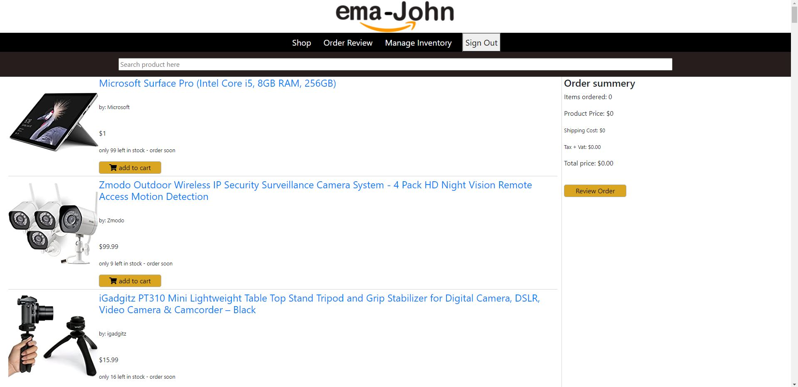

# Simple Emajohn

### [visit website](https://simple-emajohn.netlify.app/) | [live API server](https://morning-everglades-82763.herokuapp.com/)

### Features

1. You can search product.
2. Authenticated person can place order.
3. Payment system with stripe.
4. Authentication system with Google.

### Front-End Technology

+ React.js
+ JavaScript
+ CSS3
+ Bootstrap

### Back-End technology

+ Node.js
+ MongoDB(database)
+ Express.js
+ Heroku

 [Visit Back-End Code](https://github.com/rjmahfuztech/ema-john-server)
